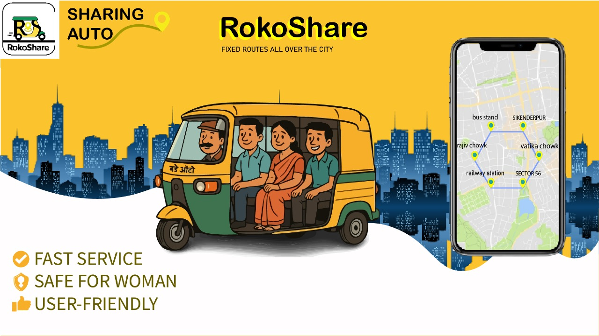

# 🚗 RokoShare - Your Daily Ride, Simplified

  

  
  
  <h2 style="color: #4FD1C7; margin-top: 20px;">Revolutionizing Shared Mobility in Gurugram</h2>
  
  
Affordable, reliable, and eco-friendly shared auto rides on fixed routes

  
  

    <a href="https://iaddy.netlify.app/" target="_blank" style="background: linear-gradient(45deg, #4FD1C7, #F39C12); color: white; padding: 12px 30px; border-radius: 30px; text-decoration: none; font-weight: bold; margin: 0 10px; box-shadow: 0 5px 15px rgba(0,0,0,0.2); transition: transform 0.3s;">🌐 Live Demo</a>
    <a href="#" style="background: linear-gradient(45deg, #F39C12, #E67E22); color: white; padding: 12px 30px; border-radius: 30px; text-decoration: none; font-weight: bold; margin: 0 10px; box-shadow: 0 5px 15px rgba(0,0,0,0.2); transition: transform 0.3s;">📱 Download App</a>
    <a href="contact.html" style="background: linear-gradient(45deg, #3498DB, #2980B9); color: white; padding: 12px 30px; border-radius: 30px; text-decoration: none; font-weight: bold; margin: 0 10px; box-shadow: 0 5px 15px rgba(0,0,0,0.2); transition: transform 0.3s;">📧 Contact Support</a>
  

  
  

    

      <strong>🎉 Coming Soon!</strong> The RokoShare app will be available soon. Stay tuned for the launch!
    

  

---

  

## 📖 Table of Contents

  

    <a href="#about-rokoshare" style="color: #4FD1C7; text-decoration: none; margin: 0 15px;">🚀 About</a>
    <a href="#features" style="color: #4FD1C7; text-decoration: none; margin: 0 15px;">✨ Features</a>
    <a href="#technology-stack" style="color: #4FD1C7; text-decoration: none; margin: 0 15px;">💻 Tech Stack</a>
    <a href="#getting-started" style="color: #4FD1C7; text-decoration: none; margin: 0 15px;">🚀 Getting Started</a>
    <a href="#project-structure" style="color: #4FD1C7; text-decoration: none; margin: 0 15px;">📁 Structure</a>
    <a href="#development" style="color: #4FD1C7; text-decoration: none; margin: 0 15px;">🔧 Development</a>
    <a href="#contributing" style="color: #4FD1C7; text-decoration: none; margin: 0 15px;">🤝 Contributing</a>
    <a href="#license" style="color: #4FD1C7; text-decoration: none; margin: 0 15px;">📄 License</a>
    <a href="#contact" style="color: #4FD1C7; text-decoration: none; margin: 0 15px;">📞 Contact</a>
  

  

---

## 🚀 About RokoShare

  

RokoShare is a cutting-edge shared mobility platform revolutionizing daily commuting in Gurugram. We bridge the gap between affordability and convenience by providing reliable, eco-friendly shared auto rides on strategically fixed routes.

### 🎯 Our Mission

  <h3 style="margin-top: 0; text-align: center;">Transforming Urban Mobility</h3>
  

    

      
💰

      <h4>Affordability</h4>
      
Budget-friendly commuting for everyone

    

    

      
🕐

      <h4>Reliability</h4>
      
Consistent, on-time service you can trust

    

    

      
🌱

      <h4>Sustainability</h4>
      
Reducing carbon footprint together

    

    

      
🚀

      <h4>Convenience</h4>
      
Simplified daily commute experience

    

  

### 🌟 Our Vision

  <h3 style="margin-top: 0; text-align: center;">Leading the Future of Mobility</h3>
  

    To become India's leading shared mobility platform, connecting communities through innovative, affordable, and eco-friendly transportation solutions.
  

  

    🎯 1M+ Happy Riders
    📍 100+ Routes
  

---

## ✨ Features

  <h3 style="color: #4FD1C7; margin-bottom: 30px;">Why Choose RokoShare?</h3>

### 🎯 Core Features

  

    

      
🗺️

    

    <h4 style="text-align: center; color: #333; margin-bottom: 15px;">Fixed Route Network</h4>
    
50+ strategically located routes across Gurugram for maximum coverage

  

  
  

    

      
💰

    

    <h4 style="text-align: center; color: #333; margin-bottom: 15px;">Affordable Pricing</h4>
    
Save up to 60% compared to traditional auto services with no surge pricing

  

  
  

    

      
📍

    

    <h4 style="text-align: center; color: #333; margin-bottom: 15px;">Real-Time Tracking</h4>
    
Live GPS tracking for complete transparency and peace of mind

  

  
  

    

      
📱

    

    <h4 style="text-align: center; color: #333; margin-bottom: 15px;">Mobile-First Design</h4>
    
Responsive design that works seamlessly on all devices

  

  
  

    

      
🛟

    

    <h4 style="text-align: center; color: #333; margin-bottom: 15px;">24/7 Support</h4>
    
Round-the-clock customer assistance for all your needs

  

  
  

    

      
🌱

    

    <h4 style="text-align: center; color: #333; margin-bottom: 15px;">Eco-Friendly</h4>
    
Reducing carbon footprint through smart shared transportation

  

### 🎨 User Experience

  <h3 style="text-align: center; margin-top: 0;">Exceptional User Experience</h3>
  

    

      
🎨

      <h5>Modern UI/UX</h5>
      
Clean, intuitive interface with smooth animations

    

    

      
🌙

      <h5>Dark Mode</h5>
      
Easy on the eyes for night-time commuters

    

    

      
⚡

      <h5>Quick Booking</h5>
      
One-tap ride booking with minimal steps

    

    

      
💳

      <h5>Multiple Payments</h5>
      
Convenient payment options for everyone

    

  

### 🛡️ Safety & Security

  <h3 style="text-align: center; margin-top: 0;">Your Safety is Our Priority</h3>
  

    

      
✅

      <h5>Verified Drivers</h5>
      
Rigorous background checks for all drivers

    

    

      
🚨

      <h5>Emergency Button</h5>
      
Instant access to support during rides

    

    

      
👥

      <h5>Share Location</h5>
      
Share ride details with trusted contacts

    

    

      
⭐

      <h5>Safety Ratings</h5>
      
Transparent driver rating system

    

  

---

## 💻 Technology Stack

  <h3 style="color: #4FD1C7; margin-bottom: 30px;">Built with Modern Technologies</h3>

### 🎨 Frontend Technologies

  

    
📄

    <h4>HTML5</h4>
    
Semantic markup for accessibility and SEO

  

  
  

    
🎨

    <h4>Tailwind CSS</h4>
    
Utility-first CSS framework for rapid styling

  

  
  

    
⚡

    <h4>Vanilla JavaScript</h4>
    
Lightweight, performant interactions

  

  
  

    
🎭

    <h4>AOS (Animate On Scroll)</h4>
    
Beautiful scroll animations

  

  
  

    
🔣

    <h4>Font Awesome</h4>
    
Comprehensive icon library

  

### 🚀 Performance & Design

  <h3 style="text-align: center; color: #333; margin-bottom: 25px;">Performance Optimizations</h3>
  

    

      
🖼️

      <h5>Lazy Loading</h5>
      
Optimized image loading

    

    

      
📦

      <h5>Code Splitting</h5>
      
Efficient resource management

    

    

      
💾

      <h5>Caching Strategy</h5>
      
Fast repeat visits

    

    

      
🔍

      <h5>SEO Optimized</h5>
      
Semantic HTML structure

    

  

### 🎭 Design & Animation Features

  <h3 style="text-align: center; margin-bottom: 25px;">Beautiful Animations & Interactions</h3>
  

    

      
🎬

      <h5>CSS Animations</h5>
      
Custom keyframe animations for smooth transitions

    

    

      
🖱️

      <h5>Hover Effects</h5>
      
Interactive elements with micro-interactions

    

    

      
📱

      <h5>Responsive Design</h5>
      
Mobile-first approach with breakpoints

    

    

      
🌈

      <h5>Gradient Effects</h5>
      
Modern visual aesthetics

    

  

---

## 🚀 Getting Started

  <h3 style="color: #4FD1C7; margin-bottom: 30px;">Quick Start Guide</h3>

### 📋 Prerequisites

  <h4 style="margin-top: 0; color: #333;">What You'll Need</h4>
  <ul style="color: #666; margin: 15px 0;">
    <li>✅ Modern web browser (Chrome, Firefox, Safari, Edge)</li>
    <li>✅ Internet connection for CDN resources</li>
    <li>✅ Basic knowledge of HTML/CSS/JavaScript (optional)</li>
  </ul>

### 📦 Installation

  <h4 style="text-align: center; color: #333; margin-bottom: 25px;">Step-by-Step Setup</h4>
  
  

    

      
1

      <h5 style="color: #333; margin-bottom: 15px;">Clone the Repository</h5>
      

        
git clone https://github.com/Xenonesis/Rokoshare.git

        
cd Rokoshare

      

    

    
    

      
2

      <h5 style="color: #333; margin-bottom: 15px;">Start Local Server</h5>
      

        
# Python 3

        
python -m http.server 8000

         
        
# Node.js

        
npx http-server

      

    

    
    

      
3

      <h5 style="color: #333; margin-bottom: 15px;">Explore the Application</h5>
      

        
• Navigate through different pages using the menu

        
• Test all interactive elements

        
• Check responsiveness on different screen sizes

        
• Try the mobile menu and search functionality

      

    

  

### 🎯 Quick Demo

  <h3 style="margin-top: 0;">Want to See It in Action?</h3>
  
Check out our live demo or download the mobile app when available!

  

    <a href="https://iaddy.netlify.app/" target="_blank" style="background: white; color: #667eea; padding: 12px 30px; border-radius: 30px; text-decoration: none; font-weight: bold; margin: 0 10px; display: inline-block; transition: transform 0.3s;">🎬 Watch Demo</a>
    <a href="#" style="background: rgba(255,255,255,0.2); color: white; padding: 12px 30px; border-radius: 30px; text-decoration: none; font-weight: bold; margin: 0 10px; display: inline-block; transition: transform 0.3s;">📱 Download App</a>
  

---

## 📁 Project Structure

  <h3 style="color: #4FD1C7; margin-bottom: 30px;">Project Organization</h3>

  

    <h4 style="color: #333; margin-top: 0;">📂 Directory Overview</h4>
    
Clean and organized structure for easy maintenance and scalability

  

  
  

    
<strong style="color: #4FD1C7;">📁 Rokoshare/</strong>

    
📄 <strong>index.html</strong>          # Homepage with hero section and services

    
📄 <strong>about.html</strong>          # About us page with mission and vision

    
📄 <strong>contact.html</strong>        # Contact and support page

    
📄 <strong>login.html</strong>          # User authentication page

    
📄 <strong>script.js</strong>           # Main JavaScript functionality

    
📄 <strong>README.md</strong>           # Project documentation

    
📁 <strong>images/</strong>             # Image assets

    
🖼️ <strong>ROKOSHARE.png</strong>   # Main logo

    
🔔 <strong>bellicon.png</strong>    # Bell icon for notifications

    
📘 <strong>rokoposter.jpg</strong>  # Service poster image

  

  
  

    

      
📄

      <h5 style="color: #333; margin: 0;">HTML Files</h5>
      
5 pages with responsive design

    

    

      
⚡

      <h5 style="color: #333; margin: 0;">JavaScript</h5>
      
Interactive features & animations

    

    

      
🖼️

      <h5 style="color: #333; margin: 0;">Images</h5>
      
3 optimized assets

    

    

      
📚

      <h5 style="color: #333; margin: 0;">Documentation</h5>
      
Comprehensive README

    

  

---

## 🔧 Development

  <h3 style="color: #4FD1C7; margin-bottom: 30px;">Development Insights</h3>

### 🎯 Key Components

  

    

      
🧭

    

    <h4 style="text-align: center; color: #333; margin-bottom: 15px;">Navigation System</h4>
    <ul style="color: #666; margin: 0; padding-left: 20px;">
      <li>Responsive desktop and mobile navigation</li>
      <li>Dropdown menus for routes</li>
      <li>Search functionality</li>
      <li>Mobile menu overlay with smooth animations</li>
    </ul>
  

  
  

    

      
✨

    

    <h4 style="text-align: center; color: #333; margin-bottom: 15px;">Animations & Effects</h4>
    <ul style="color: #666; margin: 0; padding-left: 20px;">
      <li>AOS (Animate On Scroll) integration</li>
      <li>Custom CSS animations for UI elements</li>
      <li>Hover effects and micro-interactions</li>
      <li>Loading states and transitions</li>
    </ul>
  

  
  

    

      
📝

    

    <h4 style="text-align: center; color: #333; margin-bottom: 15px;">Form Handling</h4>
    <ul style="color: #666; margin: 0; padding-left: 20px;">
      <li>Contact form with validation</li>
      <li>Newsletter subscription</li>
      <li>Login authentication (UI ready)</li>
      <li>Real-time validation feedback</li>
    </ul>
  

  
  

    

      
🎮

    

    <h4 style="text-align: center; color: #333; margin-bottom: 15px;">Interactive Features</h4>
    <ul style="color: #666; margin: 0; padding-left: 20px;">
      <li>Mobile menu toggle</li>
      <li>Search box expansion</li>
      <li>FAQ accordion</li>
      <li>Notification system</li>
      <li>Counter animations</li>
    </ul>
  

### 🎨 Customization Guide

  <h3 style="text-align: center; margin-bottom: 25px;">Customization Options</h3>
  
  

    

      
🎨

      <h4>Color Scheme</h4>
      

        
Primary: #4FD1C7 (Teal)

        
Secondary: #F7DC6F (Yellow)

        
Accent: #F39C12 (Orange)

      

    

    
    

      
🔤

      <h4>Typography</h4>
      
System font stack (sans-serif)

      
Headings: Bold with tracking

      
Body: Regular weight for readability

    

    
    

      
🎬

      <h4>Animations</h4>
      
Custom keyframes for floating, bouncing, fading

      
Smooth transitions on all interactive elements

      
Parallax effects for depth

    

  

### 🚀 Performance Optimizations

  <h3 style="text-align: center; color: #333; margin-bottom: 25px;">Performance Best Practices</h3>
  
  

    

      
⚡

      <h5>Optimized Loading</h5>
      
Fast page load times

    

    

      
📱

      <h5>Mobile First</h5>
      
Responsive design

    

    

      
🔍

      <h5>SEO Ready</h5>
      
Search engine optimized

    

    

      
♿

      <h5>Accessible</h5>
      
WCAG compliant

    

  

---

## 🤝 Contributing

  <h3 style="color: #4FD1C7; margin-bottom: 30px;">Join Our Community</h3>
  

    We welcome contributions from developers around the world! Whether it's a bug fix, new feature, or documentation improvement, your help is appreciated.
  

  <h4 style="text-align: center; color: #333; margin-bottom: 25px;">How to Contribute</h4>
  
  

    

      
🍴

      <h5 style="color: #333; margin-bottom: 10px;">1. Fork the Repository</h5>
      
Create your own copy to work on

    

    
    

      
🌿

      <h5 style="color: #333; margin-bottom: 10px;">2. Create Branch</h5>
      
Make a new feature branch

    

    
    

      
💾

      <h5 style="color: #333; margin-bottom: 10px;">3. Commit Changes</h5>
      
Save your work with clear messages

    

    
    

      
🔄

      <h5 style="color: #333; margin-bottom: 10px;">4. Open PR</h5>
      
Submit your changes for review

    

  

  
  

    <h4 style="color: #333; margin-top: 0; margin-bottom: 20px;">Development Guidelines</h4>
    

      

        ✅
        Follow existing code style
      

      

        📝
        Add comments for complex functionality
      

      

        🧪
        Test your changes thoroughly
      

      

        📱
        Ensure responsive design works
      

      

        ♿
        Maintain accessibility standards
      

      

        🔍
        Update documentation as needed
      

    

  

  <h3 style="margin-top: 0;">We Love Our Contributors!</h3>
  
Every contribution makes RokoShare better for everyone.

  

    🐛 Bug Reports
    ✨ New Features
    📚 Documentation
    💡 Ideas
  

---

## 📄 License

  <h3 style="color: #4FD1C7; margin-bottom: 30px;">License Information</h3>

  
⚖️

  <h4 style="color: #333; margin-bottom: 20px;">MIT License</h4>
  

    This project is licensed under the MIT License. This means you are free to use, modify, distribute, and sell copies of the software, subject to the conditions of the MIT License.
  

  
  

    <h5 style="color: #333; margin-top: 0; margin-bottom: 15px;">What This Means:</h5>
    <ul style="color: #666; margin: 0; padding-left: 20px;">
      <li>✅ Commercial use allowed</li>
      <li>✅ Modification allowed</li>
      <li>✅ Distribution allowed</li>
      <li>✅ Private use allowed</li>
      <li>📝 Must include license and copyright notice</li>
    </ul>
  

  
  <a href="LICENSE" style="background: linear-gradient(45deg, #4FD1C7, #44A08D); color: white; padding: 12px 30px; border-radius: 30px; text-decoration: none; font-weight: bold; margin: 10px; display: inline-block; transition: transform 0.3s;">📄 View License File</a>

  <h3 style="margin-top: 0;">Open Source & Community Driven</h3>
  

    RokoShare is proudly open source and built with the community in mind. We believe in transparency, collaboration, and the power of open development.
  

---

## 📞 Contact

  <h3 style="color: #4FD1C7; margin-bottom: 30px;">Get In Touch</h3>

  

    
    <h4 style="color: #333; margin: 0;">Developed with ❤️ by <a href="https://iaddy.netlify.app/" target="_blank" style="color: #4FD1C7; text-decoration: none;">Xenonesis</a></h4>
  

  
  

    

      
📧

      <h5 style="color: #333; margin-bottom: 10px;">Email</h5>
      <a href="mailto:rokoshare01@gmail.com" style="color: #4FD1C7; text-decoration: none; font-weight: bold;">rokoshare01@gmail.com</a>
    

    
    

      
📞

      <h5 style="color: #333; margin-bottom: 10px;">Phone</h5>
      <a href="tel:+919876543210" style="color: #F39C12; text-decoration: none; font-weight: bold;">+91 98765 43210</a>
    

    
    

      
🌐

      <h5 style="color: #333; margin-bottom: 10px;">Website</h5>
      <a href="https://iaddy.netlify.app/" target="_blank" style="color: #9B59B6; text-decoration: none; font-weight: bold;">iaddy.netlify.app</a>
    

  

  
  

    <h5 style="color: #333; margin-bottom: 20px;">Follow Us On Social Media</h5>
    

      <a href="#" target="_blank" style="display: inline-flex; align-items: center; justify-content: center; width: 50px; height: 50px; background: linear-gradient(45deg, #4267B2, #365899); color: white; border-radius: 50%; text-decoration: none; transition: transform 0.3s;">
        <i class="fab fa-facebook-f" style="font-size: 1.2em;"></i>
      </a>
      <a href="#" target="_blank" style="display: inline-flex; align-items: center; justify-content: center; width: 50px; height: 50px; background: linear-gradient(45deg, #1DA1F2, #0D8BD9); color: white; border-radius: 50%; text-decoration: none; transition: transform 0.3s;">
        <i class="fab fa-twitter" style="font-size: 1.2em;"></i>
      </a>
      <a href="#" target="_blank" style="display: inline-flex; align-items: center; justify-content: center; width: 50px; height: 50px; background: linear-gradient(45deg, #E4405F, #C13584); color: white; border-radius: 50%; text-decoration: none; transition: transform 0.3s;">
        <i class="fab fa-instagram" style="font-size: 1.2em;"></i>
      </a>
      <a href="#" target="_blank" style="display: inline-flex; align-items: center; justify-content: center; width: 50px; height: 50px; background: linear-gradient(45deg, #0077B5, #005885); color: white; border-radius: 50%; text-decoration: none; transition: transform 0.3s;">
        <i class="fab fa-linkedin-in" style="font-size: 1.2em;"></i>
      </a>
      <a href="https://github.com/Xenonesis" target="_blank" style="display: inline-flex; align-items: center; justify-content: center; width: 50px; height: 50px; background: linear-gradient(45deg, #333, #24292e); color: white; border-radius: 50%; text-decoration: none; transition: transform 0.3s;">
        <i class="fab fa-github" style="font-size: 1.2em;"></i>
      </a>
    

  

  <h3 style="margin-top: 0; margin-bottom: 20px;">Interested in Joining Our Team?</h3>
  

    We're always looking for passionate developers, designers, and problem-solvers who want to make a difference in urban mobility.
  

  

    <a href="mailto:rokoshare01@gmail.com" style="background: white; color: #667eea; padding: 15px 35px; border-radius: 30px; text-decoration: none; font-weight: bold; margin: 0 10px; display: inline-block; transition: transform 0.3s;">💼 Careers</a>
    <a href="contact.html" style="background: rgba(255,255,255,0.2); color: white; padding: 15px 35px; border-radius: 30px; text-decoration: none; font-weight: bold; margin: 0 10px; display: inline-block; transition: transform 0.3s;">🤝 Partnerships</a>
  

---

  

    <h3 style="margin-top: 0; margin-bottom: 15px;">Made with ❤️ for the Community</h3>
    

      Thank you for checking out RokoShare! We're committed to making urban transportation better, one ride at a time.
    

    

      
      Community-driven project
    

  

  

    © 2024 RokoShare. All rights reserved. | 
    <a href="#" style="color: #4FD1C7; text-decoration: none;">Privacy Policy</a> | 
    <a href="#" style="color: #4FD1C7; text-decoration: none;">Terms of Service</a> | 
    <a href="contact.html" style="color: #4FD1C7; text-decoration: none;">Contact</a>
  

